# Entity Framework

> Методичка по ORM от Microsoft. Это средство позволяет легко и безболезненно работать с данными в базе данных, оперируя терминами объектно-ориентированного программирования.
>
> Актуальные версии на момент написания методички -- EntityFramework  6.2.0, Visual Studio 2017. Вероятно, что если вы читаете эти материалы в далёком будущем, у вас всё не так, как тут расписано. :disappointed:

## Введение

### Проблема семантического разрыва

C# является объектно-ориентированным языком, в котором все данные представлены в виде объектов классов. В то же время реляционные базы данных представляют собой таблицы однородных данных со связями между ними. Получается, что поля одного объекта могут храниться в разных таблицах базы данных. Это вызывает значительные проблемы в работе программистов, а также, значительно замедляет информационную систему: приходится вычитывать и сохранять данные в реляционной форме, а обрабатывать в объектной.

Проблема хранения объектно-ориентированных данных в реляционных таблицах и называется **проблемой семантического разрыва**.

### Что такое Entity Framework

**Entity framework** является ORM от Microsoft. Использование EF позволяет повысить уровень абстракции от базы данных, избежать непосредственной работы с запросами. Говоря проще, Entity Framework создан, чтобы значительно облегчить жизнь каждому программисту. С помощью EF, разработчик может работать с данными в системе, используя объекты классов предметной области. Использование EF позволяет при необходимости использовать различные СУБД, в то время как код информационной системы остаётся неизменным. Для выборки из БД Entity Framework использует **LINQ-запросы**. 

### Подходы взаимодействия с базой данных

Entity Framework предполагает три возможных способа взаимодействия с базой данных:

* **Database first**: разработчик создаёт реляционную базу данных, затем, по базе данных, Entity Framework создает набор классов, которые отражают её модель и саму модель;
* **Model first**: сначала разработчик создает модель базы данных, по которой затем Entity Framework создает реальную базу данных на сервере и классы модели в приложении;
* **Code first**: разработчик создает классы модели данных, которые будут храниться в БД, а затем Entity Framework по этой модели генерирует базу данных и ее таблицы

### Быстрый старт

Для того, чтобы начать работать с Entity Framework, вам понадобится развёрнутая база данных -- пустая или заполненная в зависимости от выбранного подхода к разработке. Кроме этого, конечно же, необходимы Visual Studio -- для написания кода на C# и MS SQL Management Studio для работы с базой данных.

Для того, чтобы ваш проект мог работать с базой данных через Entity Framework, вам необходимо установить в свой проект NuGet пакет Entity Framework 6 следующим образом:

1. ПКМ по проекту, затем, в контекстном меню нужно выбрать "Manage NuGet packages"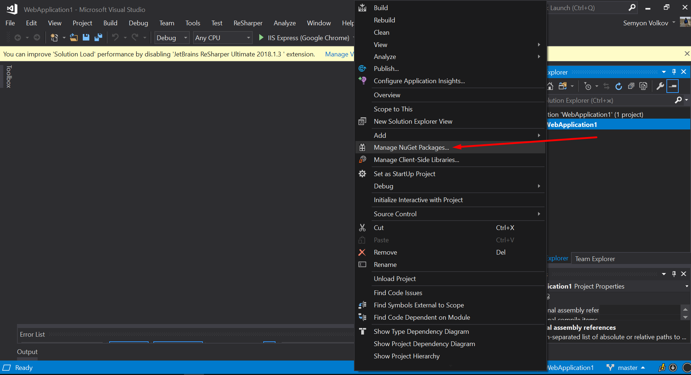
2. В менеджере пакетов перейти на вкладку "Browse", найти  EntityFramework и нажать кнопку "Установить".
   Стоит отметить, что, возможно,  Entity Framework уже установлен в ваш проект, в таком случае вы можете его обновить.
   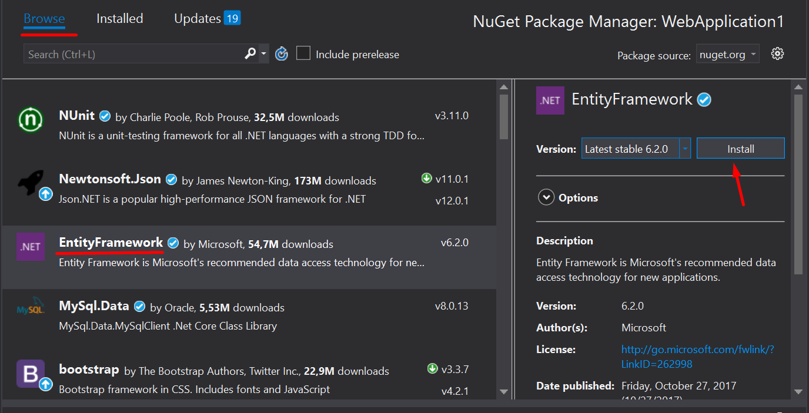

Поздравляю, мы сделали самое важное -- положили начало продуктивной работе над приложением базы данных.

## Database first

Для использования подхода Database first необходимо, чтобы у вас уже была база данных, именно по ней EF будет строить модель и классы приложения. Схема моей базы данных приведена ниже.

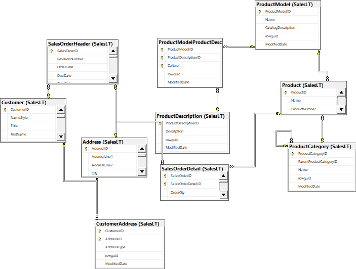

После установки Entity Framework в приложение, необходимо создать модель. Для этого необходимо нажать правой кнопкой мыши по папке проекта, выбрать в меню "Add / New Item", в меню выбрать ADO.NET Entity Data Model.

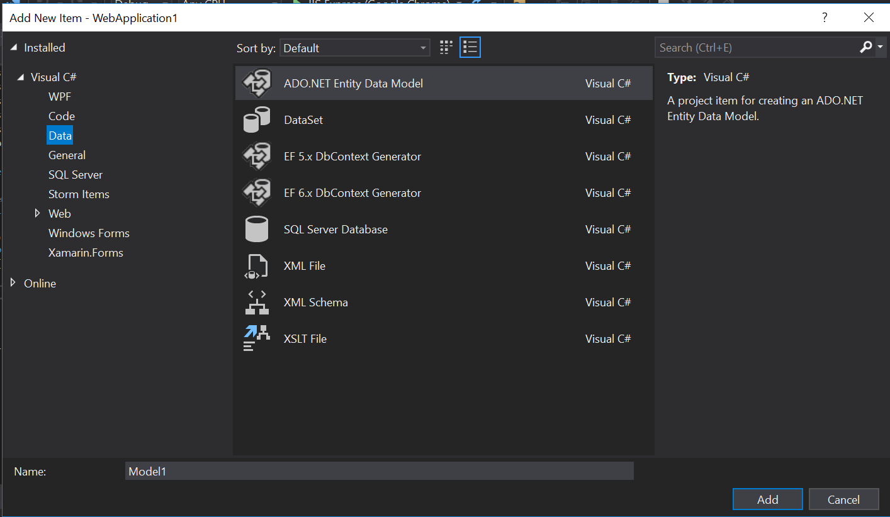

После этого откроется мастер создания модели. Так как мы используем подход Database First, выбираем соответствующий элемент меню.

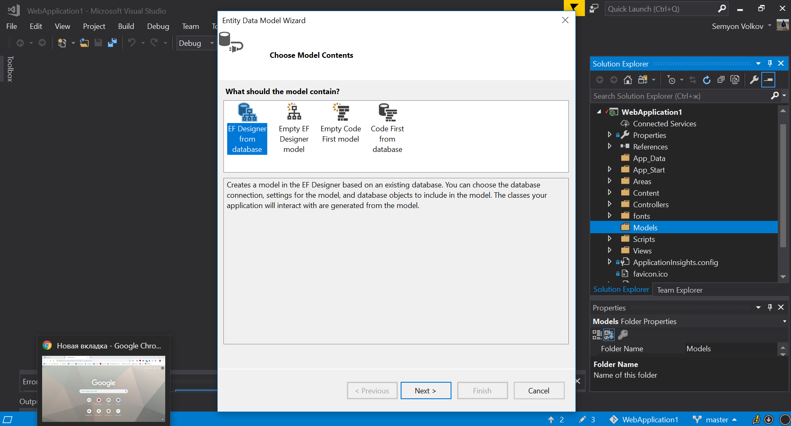

После этого, необходимо настроить подключение к базе данных. Нажимаем кнопку "New Connection", в следующем меню выбираем подключение к Microsoft SQL Server.

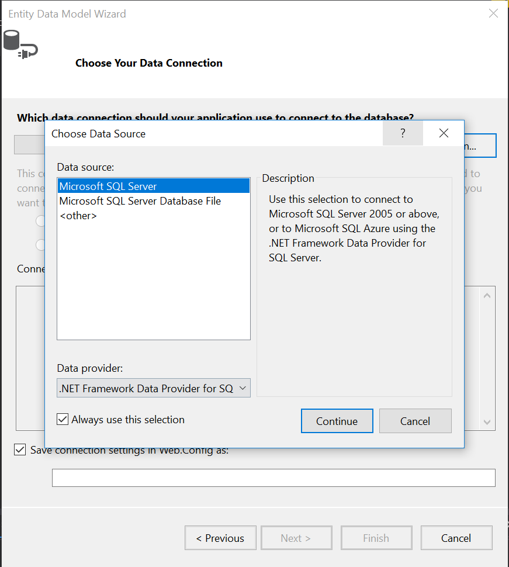

После этого настраиваем подключение к базе данных, всё как Microsoft SQL Managment Studio. Выбираем сервер из списка, затем выбираем базу данных на сервере. Так как у меня база данных развернута удалённо, мне необходимо указать логин и пароль.

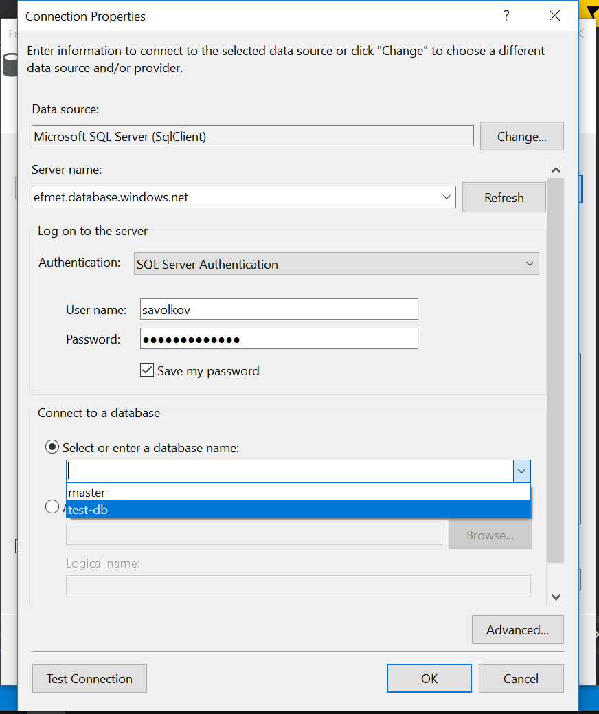

После выбора стоит нажать кнопку "Test Connection", чтобы убедиться, что всё в порядке. У меня всё в порядке.


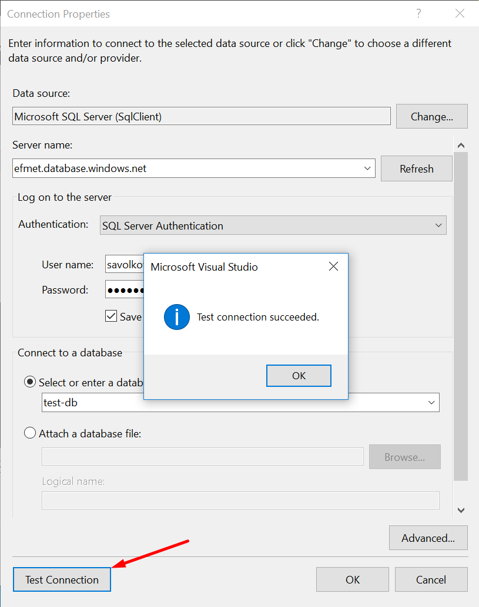

После создания подключения, мастер предложит сохранить строку подключения и задать её имя. **Именно по этому имени вы сможете обращаться к базе данных в коде, не забудьте его.** 

Обратите внимание, есть возможность сохранить пароль базы данных в файл конфигурации или не сохранять его. От этого выбора зависит ваша программа: если вы не сохраните пароль в строку соединения -- придется его спрашивать у пользователя или откуда-то вычитывать. Если вы хотите упростить себе жизнь -- сохраните пароль в строку соединения.

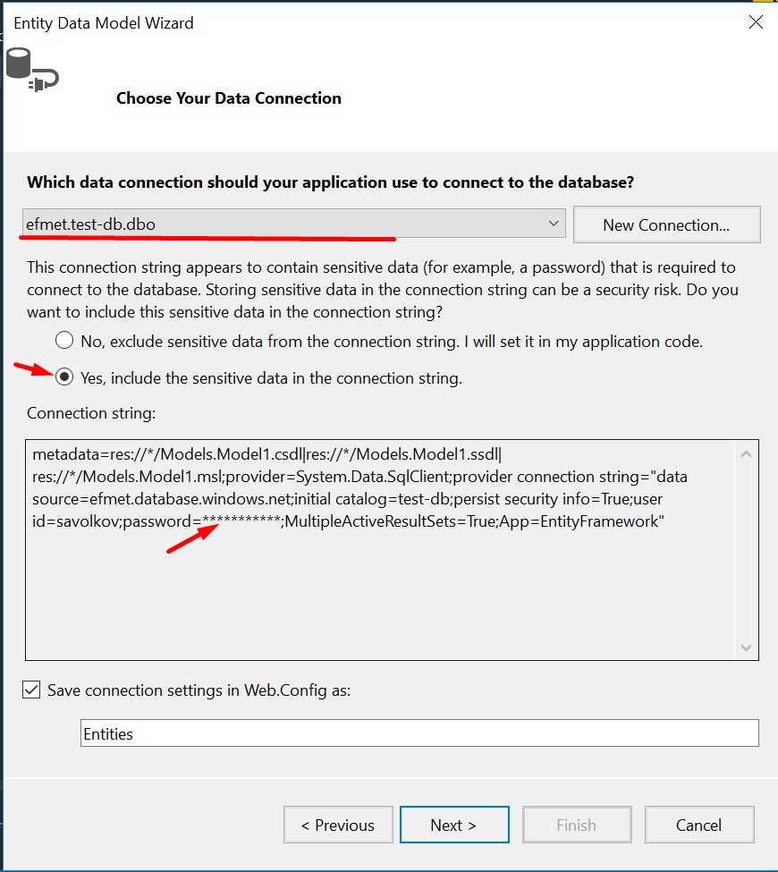

Переходим к следующему шагу. Мастер подключился к базе и предлагает выбрать какие таблицы необходимо добавить в модель. Выберите необходимые вам таблицы. Кроме этого, советую поставить галочку "Pluralize or singularize generated object names". Она поможет вам ориентироваться в свойствах сгенерированных объектов и понимать тип связи исходя из семантики навигационного свойства.

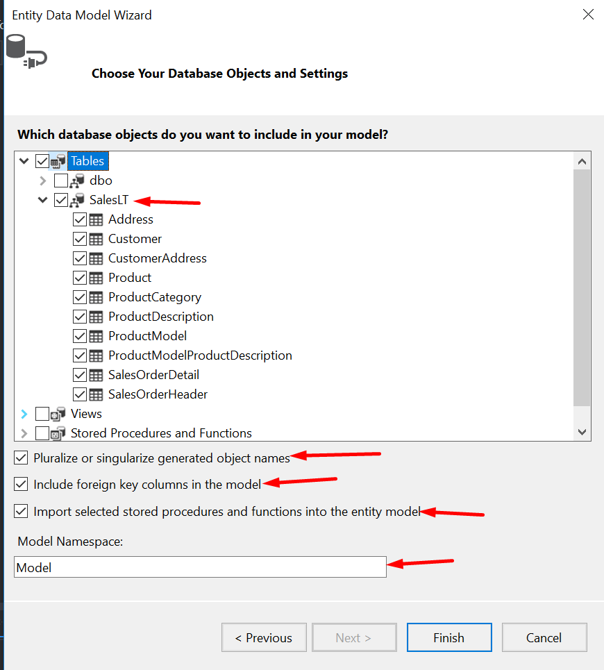

После нажатия кнопки "Finish" начнётся генерация модели, а затем, классов по этой модели. После генерации откроется схема модели. Если сравнить её со схемой базы данных можно увидеть различия.

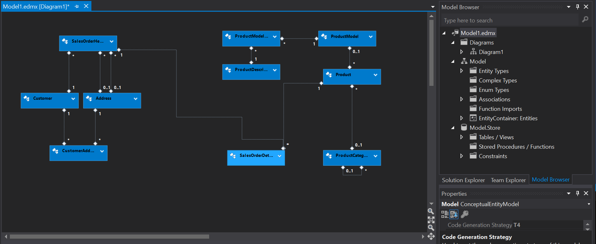

Модель хранится в виде .edmx-файла, который включает в себя в том числе и сгенерированные классы. Они находятся внутри модели, в .tt-файле. При необходимости, их можно редактировать, но учтите, что при перегенерации кода в случае изменения модели, ваши изменения будут утрачены. 

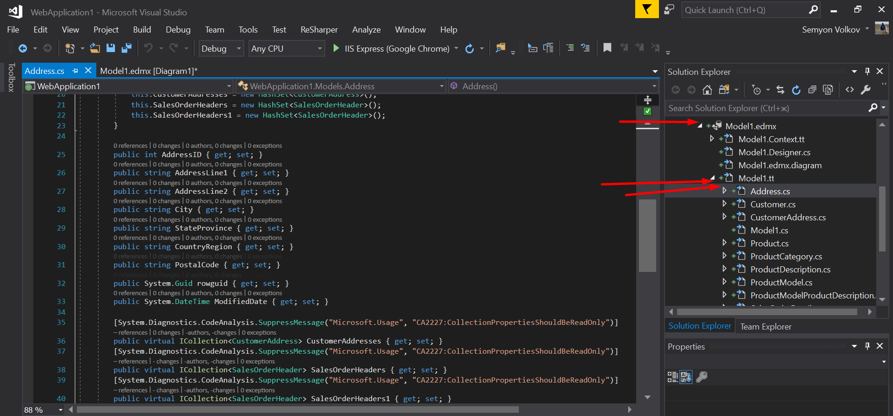

После этого, вы можете работать с базой, используя Entity Framework. Напишем несколько простых запросов, чтобы понять принцип работы.

#### Чтение данных

Напишем простой запрос на вычитку всех данных из таблицы `Customers`. Для этого создадим контекст данных, вызвав конструктор класса `Entities`. (А почему именно `Entities` -- смотри ранее, мы задавали это имя самостоятельно). 

В элементе класса `Entities` `e` хранятся все классы, которые мы сгенерировали. Для того, чтобы получить все элементы класса Customer, обратимся к свойству `e.Customers`.

```c#
Entities e = new Entities(); // создание контекста
var customers = e.Customers;
```

Попробуем создать запрос с фильтрацией. Попробуем выбрать все товары, цена которых составляет более 1000.

 ```c#
Entities e = new Entities();
var products = e.Products.Where(product => product.ListPrice > 1000);
 ```

#### Добавление данных

Добавим новый элемент класса `Product`. Для этого создадим новый экземпляр класса `Product`. Заполним поля как нам необходимо, затем добавим класс в контекст методом `Add()` и вызовем метод `SaveChanges()` контекста, чтобы сохранить изменения.

```C#
Entities e = new Entities();
Product p = new Product();
<....>
e.Products.Add(p);
e.SaveChanges();
```

#### Изменение данных

Изменение данных проводится аналогично добавлению. Исключение -- изменяемый элемент необходимо вычитать из базы данных.  Метод `FirstOrDefault()` возвращает первый элемент, соответствующий заданному условию и стандартный (Default), если элемент не был найден.

После вычитки изменяем свойство и вызываем метод `SaveChanges()` контекста. Изменения отправлены в базу.

```c#
Entities e = new Entities();
Product product = e.Products.FirstOrDefault(p => p.Name == "HL Road Frame - Black, 58");
product.Name = "TEST";
e.SaveChanges();
```

#### Удаление данных

Удаление проводится аналогично изменению. Необходимо вычитать удаляемый объект, применить метод контекста `Remove()` и `SaveChanges()`.

```c#
Entities e = new Entities();
Product product = e.Products.FirstOrDefault(p => p.Name == "HL Road Frame - Black, 58");
e.Products.Remove(product);
e.SaveChanges();
```

## Использование Entity Framework в ASP.NET MVC

ASP.NET MVC -- это фреймворк для создания веб-приложений, реализующий паттерн MVC.

Используя Entity Framework можно быстро и просто создать прототип веб-приложения. Сгенерированный прототип позволяет совершать операции CRUD с помощью веб-интерфейса. После генерации его можно быстро доделать до необходимого уровня вручную.

 ### Создание элементов

Для того, чтобы создать интерфейс для операций CRUD над определённым классом, необходимо проделать следующие действия.

1. Нажать правой кнопкой мыши по папке `Controllers` MVC-проекта. В контекстном меню выбрать *Add / New scaffolded item*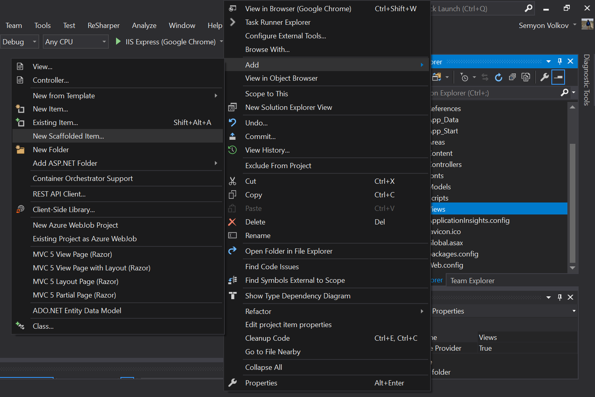
2. В окне мастера выбрать "MVC 5 Controller with views, using Entity Framework".

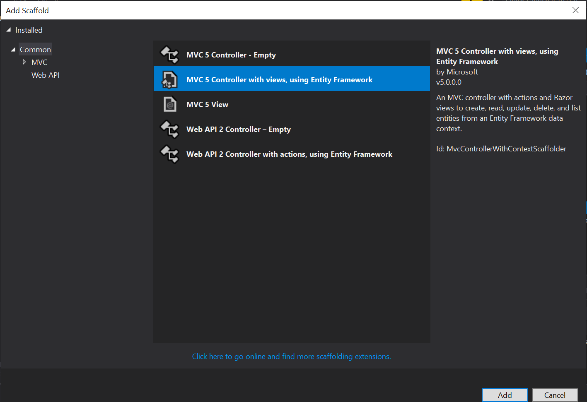

3. Затем, необходимо выбрать имя класса, для которого будет происходить генерация, класс контекста данных (его мы создавали в предыдущей главе). На скриншоте показаны пункты, необходимые для правильной работы. Имя также сгенерируется автоматически. Скорее всего, оно нам подойдёт.

    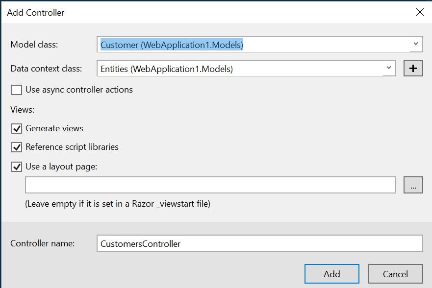

5. После нажатия кнопки "*Add*" выполнится генерация, представления будут находиться в папке Views, контроллер -- в папке Controllers. Можно запустить веб-приложение. Сгенерированные формы можно открыть по адресу /*ИмяКласса*/ (в моем случае, *http://localhost:56396/Customers*). При переходе по адресу мы видим таблицу с экземплярами классов. К каждому экземпляру можно применить действие: изменить, удалить или узнать детали. Также можно создать новый экземпляр. Прототип приложения получен.

   

### Изменение сгенерированных форм

Сгенерированные формы можно менять. Разберёмся, что получается в результате генерации и как с этим работать дальше.

#### Контроллер

Сгенерированный контроллер содержит в себе четыре метода: `Index()`, `Details(int? id)`, `Create()`, `Create([Bind(Include = "..."] *ВашКласс* *вашкласс*)`, `Edit()`, `Edit([Bind(Include = "..."] *ВашКласс* *вашкласс*)`, `Delete(int? id)`, `DeleteConfirmed(int? id) `

Как нетрудно догадаться, эти методы и выполняют операции CRUD. Как можно заметить, методов `Create`, `Edit`, `Delete` несколько: это связано с тем, что перегрузки методов реализуют разные HTTP-методы: `Get` --для вывода информации об объекте, над которым проводится операция и `POST` -- для исполнения операции над ним.   В аргументы методов передается ID объекта, над которым операция проводится. Методы содержат необходимый минимум проверки аргумента -- на его отсутствие.

#### Представление

Каждый из контроллеров может возвращать несколько представлений: `Create`, `Delete`, `Details`, `Edit`, `Index`. Им соответствуют вышеописанные методы. В контроллерах используется синтаксис разметки [Razor](https://metanit.com/sharp/mvc/4.3.php). По сути, это привычный HTML, но он позволяет использовать некоторые методы C# после указания символа `@`.

Возможно вы заметили, что после генерации у элементов интерфейса странные подписи, которые могут соответствовать именам колонок базы данных. Эти подписи берутся из сгенерированного Entity Framework класса. Вы можете изменить их, прописав их в представлении вручную, либо использовать атрибут `[Display]` в классе следующим образом:

```C#
        [Display(Name = "Имя")]
        public string FirstName { get; set; }

        [Display(Name = "Отчество")]
        public string MiddleName { get; set; }

        [Display(Name = "Фамилия")]
        public string LastName { get; set; }
```

